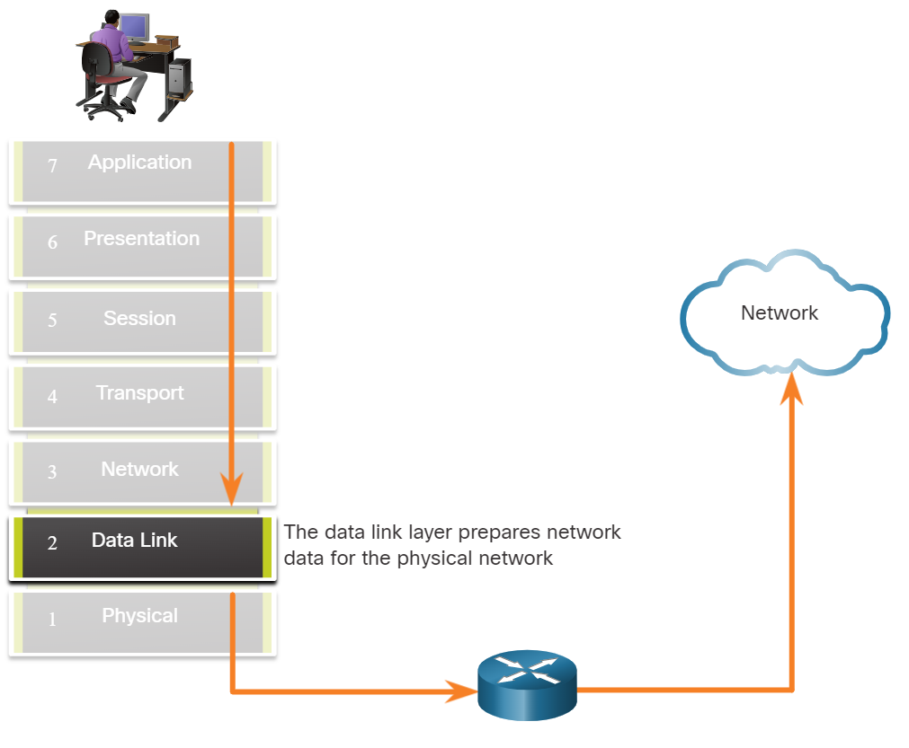

# Module 6 data link layer

## 6.1.1

### Module The data link layer

The data link layer of the OSI model (Layer 2), as shown in the figure, prepares network data for the physical network. The data link layer is responsible for network interface card (NIC) to network interface card communications.

### What the data link does:

- Enabels upper layer to access the media.
- Accept data, usually Layer 3 packets IPv4 or IPv6 and encapsulates them into Layer 2 frames.
- Controls how data is placed and recieved on the media.
- Exchange frames between endpoints over the network media.
- Receives encapsulated data, usually Layer 3 packets, and directs them to the proper upper-layer protocol.
- Performs error detection and rejects any corrapt frame.

### Node:

In computer network is a device that can receive, create, store, or foward data along communicatins path. A node can be either an end device such as laptop or mobile phone, or an intermidiary device such as an ethernet switch.

Without the data link layer, network layer protocols such as IP, would have to make provision for connecting to every type of media that could exist along a delivery path.

the figure displays an example of how the data link layer adds layer 2 Ethernet destination and source NIC  information to a Layer 3 packets. It would then convert this information to a format support by the physical layer (i.e Layer 1)

## 6.1.2

### IEEE 802 LAN/MAN Data Link Sublayers

IEE 802 LAN/MAN standerds are specific to Ethernet LANs, wireless LANs(WLAN), wireless peresonal area network (WPAN) and other types of local and metropolitan area networks. The IEEE 802 LAN/MAN  data link layer consist  of the following two sublayers: 

- **Logical Link Control(LLC)-** This IEEE 802.2 sublayer communicates between the networking software at  the upper layer and the device hardware at the loweer layers. It places information in the frame that identifies wich network layer protocol is being used for the frame. This information allows multiple Layer 3 protocols, such as IPv4 and IPv4 6, to use the same network interface and media.
- **Mediaa Access Control(MAC)-** Implements this sublayer (IEEE 802.3 802.11, or 802.15) in hardware. It is reposnsible for data encapsulation and media access control. It provides data link layer addressing and it is integrated with various physical layer technologies.

the figure shows the two sublayers (LLC & MAC) of the data link layer.

The **LLC**  sublayer takes the network protocol data, which is typically an IPv4 orIPv6 packet, and adds Layer 2 control information to help deliver the packet to the destination node.

the **MAC** sublayer controls the NIC and other hardware that is responsible for sending and receiving data on the wired or wirless LAN/MAN medium.

the MAC sublayer provides data encapsulation:

- **Frame delimiting**- the framing process provides important delimit to identify fields whithin a frame. Thesee delimiting bits provide sychornization between the transmitting and receiving nodes 
- **Addressing**- Provides source and destination addressing for transporting the Layer 2 frame between device on the same chared medium.
- **Error detection**- Includes a trailer used to detect transmission errrs.

The MAC sublayer also provides media access control, allowing multiple device to communicate over shared (half-duplex) medium. Full-duplex communications do not require access control.